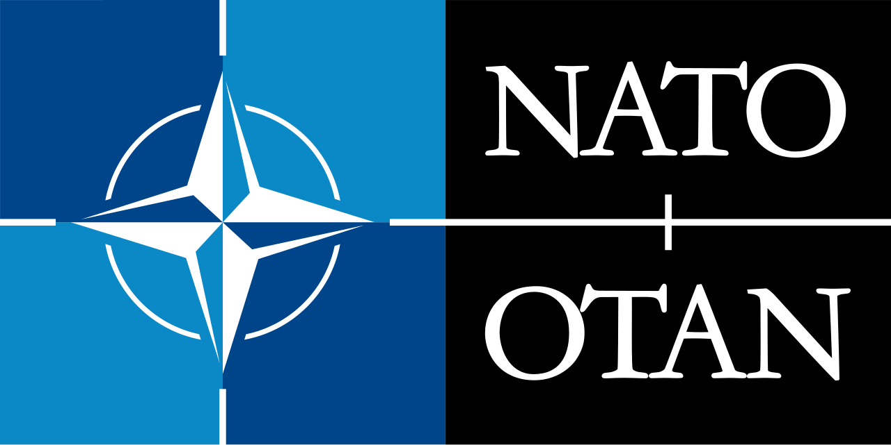
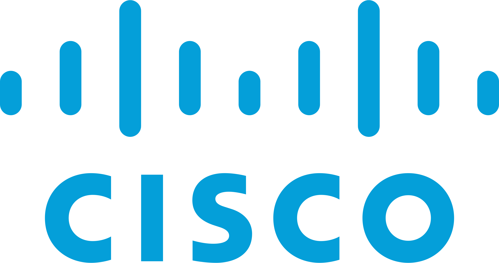
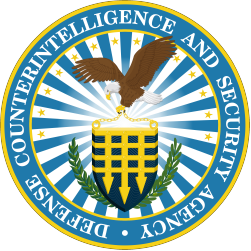
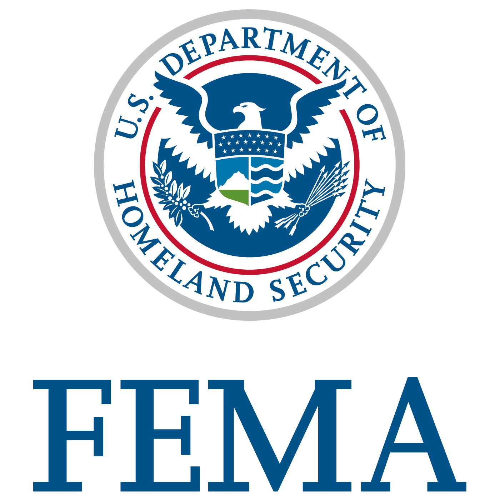
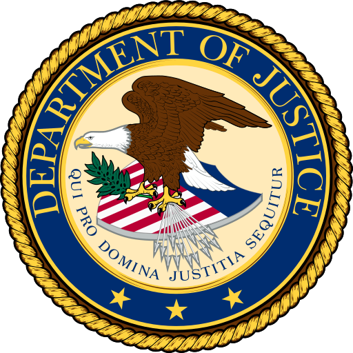
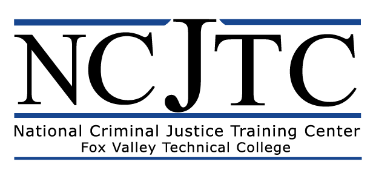
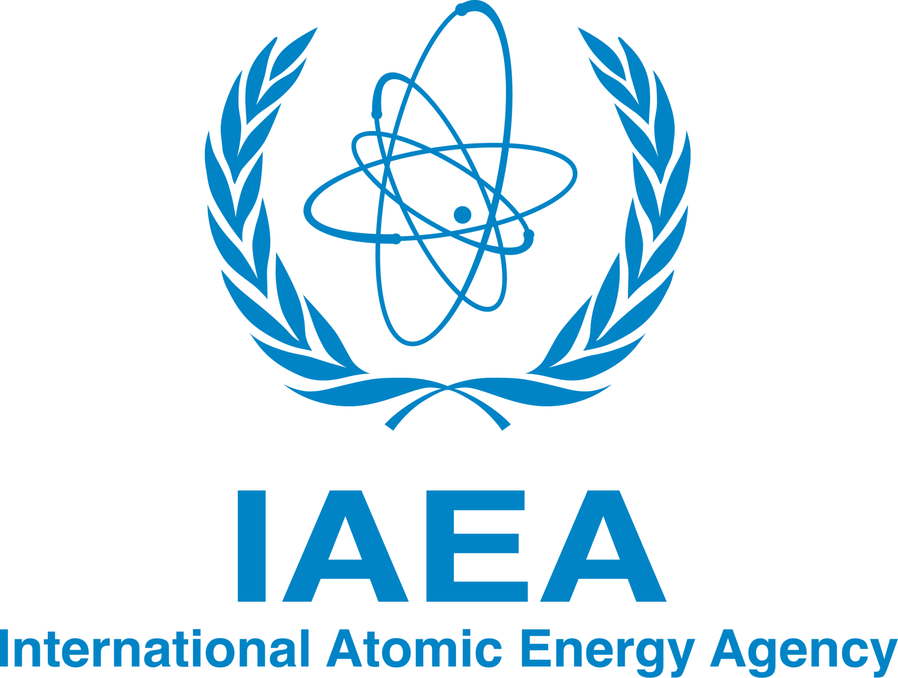

# Sylvester Kaczmarek - Space, AI & Robotics Cybersecurity

## Public Notice

This portfolio is a public document and contains no sensitive or classified information. All contents are suitable for general audiences and comply with all applicable confidentiality agreements.

## Introduction

I am Sylvester Kaczmarek, specializing in the crossroads of space robotics, satellite operations, autonomous systems, and secure data management, with a primary emphasis on their cybersecurity. My integrated approach to these domains ensures that the technology of tomorrow is both secure and optimized today.

## Table of Contents

* [Statement](./#statement)
* [Professional Overview & Contributions](./#professional-overview--contributions)
  * [Academic Roles](./#academic-roles)
  * [Relevant Publications](./#relevant-publications)
  * [Books in Progress](./#books-in-progress)
* [Cybersecurity & Resilience Credentials](./#cybersecurity--resilience-credentials)
* [Academic Roles](./#academic-roles)
* [Cybersecurity Tools & Skills](/resources/skills.md)
* [Portfolio Projects](/resources/projects.md)
* [License](./#license)
* [Contact](./#contact)

## Statement

In an era where AI governs data, robots are becoming our co-workers, and space is the new frontier, my mission in cybersecurity is not just to protect, but to pave the way for groundbreaking innovation. I aspire to be a leading figure in this field, securing space assets and missions while pioneering the development of next-generation security protocols and technologies for the future of space exploration. I am dedicated to ensuring that as we push the boundaries of what's technologically possible, we remain grounded in what's technologically secure.

## Professional Overview & Contributions

For a comprehensive overview of my professional journey, including my resume, education, and certifications, please visit:

* [LinkedIn Profile](https://www.linkedin.com/in/sylvesterkaczmarek/)
* [Personal Website](http://www.sylvesterkaczmarek.com)

### Academic Roles

I serve as a professor of Cryptography and Secure Communications, and Secure Software Development for both the MSc in Enterprise Cybersecurity and BSc in Modern Computer Science programs in Italy, and as an associate professor of Systems Engineering, Cybersecurity, and AI/ML for Space Systems & Infrastructure in Florida, US.

### Relevant Publications

In line with my ongoing contributions to the field, I have authored and co-authored various publications. Listed below are some of the latest publications that are not under NDA and are unclassified:

1. [Cybersecurity for satellites is a growing challenge, as threats to space-based infrastructure grow](https://theconversation.com/cybersecurity-for-satellites-is-a-growing-challenge-as-threats-to-space-based-infrastructure-grow-223877) (The Conversation)
2. [We Need Cybersecurity in Space to Protect Satellites](https://www.scientificamerican.com/article/we-need-cybersecurity-in-space-to-protect-satellites/) (Scientific American)
3. [In the new space race, hackers are hitching a ride into orbit](https://www.cnbc.com/2024/11/30/in-new-space-race-hackers-hitching-ride-into-orbit.html) (CNBC)
4. [Securing the Stars: Addressing Cybersecurity Challenges in Space Exploration](https://www.cyberdefensemagazine.com/newsletters/march-2024/mobile/index.html#p=119) (Cyber Defense Magazine)
5. [Defending Space Assets From Emerging Threats](https://www.cybersecurityintelligence.com/blog/defending-space-assets-from-emerging-threats-7627.html) (Cyber Security Intelligence)
6. [Space Cybersecurity: Protecting Our Final Frontier](https://www.linkedin.com/pulse/space-cybersecurity-protecting-our-final-frontier-sylvester-kaczmarek/) (LinkedIn Article)
7. [Cybersecurity for Space Assets: Focusing on SmallSats and CubeSats](https://sylvesterkaczmarek.com/blog/cybersecurity-for-space-assets-focusing-on-smallsats-and-cubesats/) (Personal Blog)
8. [Exploring Global Space Programs: Insights from the CIA's](https://www.linkedin.com/pulse/exploring-global-space-programs-insights-from-cias-kaczmarek) (LinkedIn Article)
9. [Space Cyber Hacking](https://hakin9.org/space-cyber-hacking/) (Hakin9 Magazine)
10. [What are robots thinking?](https://www.thersa.org/comment/2022/10/what-are-robots-thinking) (the Royal Society)
11. [The Evolution of Space Industry Cybersecurity: Embracing Zero Trust](https://www.linkedin.com/pulse/evolution-space-industry-cybersecurity-embracing-zero-kaczmarek/) (LinkedIn Article)
12. [Cybersecurity Measures in Modern Space Exploration](https://pentestmag.com/cybersecurity-measures-in-modern-space-exploration/) (PenTest Magazine)
13. [Cybersecure Lunar Rovers, Safeguarding Moon Exploration](https://www.flipsnack.com/688D7FBBDC9/i2-november-2023/full-view.html), co-authored with William Ferguson (Interstellar Integrity (i2), Pages 4-9)
14. [Space cybersecurity: Protecting vital infrastructure beyond Earth’s atmosphere](https://www.innovationnewsnetwork.com/space-cybersecurity-protecting-vital-infrastructure-beyond-earths-atmosphere/46535/) (Innovation News Network)
15. [Why the future of space exploration needs a lunar time zone](https://digitalfrontier.com/articles/moon-time-zone-spacex-blue-origin-bezos-musk) (Digital Frontier)
16. [Why do we need coordinated moon time?](https://open.spotify.com/episode/4kgHybSJ5xk3JG6of1otAZ) (The Dispatch Podcast)
17. [Cybersecurity Challenges in Space Exploration](https://www.cutter.com/article/cybersecurity-challenges-space-exploration) (Arthur D. Little)
18. [AI Risks and Challenges: Bias, Misuse, Unintended Consequences, and Existential Threats](https://www.linkedin.com/pulse/ai-risks-challenges-bias-misuse-unintended-threats-kaczmarek-jlaee/) (Safe AI in the Quantum Era Newsletter)
19. [How Unmanned Surface Vehicles Reshape Strategy for Taiwan](https://www.frontsight.vc/posts/how-unmanned-surface-vehicles-reshape-strategy-for-taiwan) (Frontsight Venture Capital)
20. [Enhancing Urban Safety & Counter-Terrorism through Satellite Security](https://content.yudu.com/web/3zs7s/0A3zs7y/CSMSummer24/html/index.html?page=20&origin=reader) (City Security magazine)
21. [Biggest space dangers revealed as movie clichés debunked and spacewalks explained](https://www.dailystar.co.uk/news/latest-news/biggest-space-dangers-revealed-movie-33984829)
22. [As threats to space-based infrastructure grow, cybersecurity for satellites is a growing challenge](https://www.business-reporter.co.uk/technology/cybersecurity-for-satellites-is-a-growing-challenge-as-threats-to-space-based-infrastructure-grow)
23. [DDoS Attacks Pose Increasing Threat to Satellite and Ground Operators](https://www.kratosdefense.com/constellations/articles/ddos-attacks-pose-increasing-threat-to-satellite-and-ground-operators)
24. [The Evolving Cybersecurity Landscape in Space: A New Frontier for National Security](https://www.afcea.org/signal-media/cyber-edge/evolving-cybersecurity-landscape-space-new-frontier-national-security) (Armed Forces Communications & Electronics Association International (AFCEA))

For public publications, subscribe to my [LinkedIn Newsletter](https://www.linkedin.com/build-relation/newsletter-follow?entityUrn=7025990944319524864). In-depth articles are available upon request.

### Books in Progress

I am currently authoring two books for leading academic publishers:

*   **_The Future of Lunar Space Exploration: Autonomous Robotics, Business, and Socioeconomic Impact_** (Springer). This book provides a definitive analysis of the rapidly evolving landscape of lunar exploration, forecasting the critical roles of autonomous robotics, cybersecurity, AI, emerging commercial markets, and the profound societal implications of a sustained human presence on the Moon.
*   **"Data Management and Privacy Concerns in AI"** (Chapter in _Integrating Business and AI_, Routledge, Taylor & Francis Group). This chapter addresses the urgent need for robust data governance and privacy frameworks in the age of AI, offering practical solutions and strategic insights for navigating the complex ethical and security challenges, particularly within the mission-critical aerospace and defense sectors.

## Cybersecurity & Resilience Credentials

The following logos represent some of the key organizations from which I have received cybersecurity and resilience training and certifications:

|  |  |  |  |
|---|---|---|---|
|  |  |  |  |
|  |  |  |  |
|  |  |  |  |

My expertise is validated by extensive training and certifications from these and other leading global organizations, including multiple certified trainings from CISA (Cybersecurity and Infrastructure Security Agency), a division of the United States Department of Homeland Security, DCSA (Defense Counterintelligence and Security Agency), a part of the United States Department of Defense (DoD), NATO Allied Command Transformation, Google, Cisco, and the British Government's National Cyber Security Centre (NCSC). I am certified ISO/IEC 27001:2022. I also completed the 9-month Google Cybersecurity Certification Program with 97.91% grade achieved, and earned the Ce-CSP certification after a rigorous 6-month program with 600+ hours of study, labs, assessments, and quizzes simulating real-world work environments, where I achieved top results and ranked #1. Furthermore, I have expanded my expertise with specialized training in AI Security from Infosec, covering the legal and technical aspects of AI governance and risk management. I hold the highly regarded Certificate of Cloud Security Knowledge (CCSK) from the Cloud Security Alliance, including v4 (with a score of 93%) and the latest v5 (achieving a score of 98%), demonstrating mastery of modern cloud security principles, including Zero Trust and DevSecOps.

In addition to my cybersecurity expertise, I have completed certified trainings with the Federal Emergency Management Agency (FEMA), focusing on comprehensive emergency response and crisis management. I also completed certified training with the National Criminal Justice Training Center (NCJTC), in partnership with the United States Department of Justice (DOJ), Office of Justice Programs (OJP), and the Office of Juvenile Justice and Delinquency Prevention (OJJDP), gaining skills to identify abuse, engage stakeholders, and develop prevention strategies using actionable frameworks. These trainings underscore my commitment to handling a wide range of crises effectively, ensuring the security and resilience of critical infrastructure, and addressing societal challenges in the face of diverse challenges. 

My commitment to international security and cooperation extends to specialized training with the United Nations System Staff College in Peacekeeping-Intelligence, Surveillance, and Reconnaissance (PKISR), covering legal frameworks, operational processes, and management of PKISR activities in UN peacekeeping missions. I also completed a cyberdiplomacy training course from the United Nations Office for Disarmament Affairs, focusing on the work of the UN Group of Governmental Experts (GGEs) in addressing ICT threats in international security. Additionally, I completed training with the International Atomic Energy Agency (IAEA) on Information and Computer Security, with a focus on Secure Software Development, achieving a score of 98.72%, covering key areas such as authentication, encryption, and data validation.

### Additional Expertise & Credentials

Beyond the core cybersecurity certifications listed above, I possess a range of specialized credentials and extensive experience across related fields, including advanced AI and autonomous systems. These were obtained through rigorous training, research, and practical application from globally recognized organizations and institutions. A comprehensive list of my training, certifications, and achievements is available upon request for qualified inquiries.

## License

All rights reserved. Unauthorized use, modification, distribution, or reproduction of this work is prohibited. See the [LICENSE](LICENSE/) file for details.

## Contact

For sensitive matters, inquiries, or professional collaborations, please reach out via email at [space.stranger698@8shield.net](mailto:space.stranger698@8shield.net). I also welcome connections on [LinkedIn](https://www.linkedin.com/in/sylvesterkaczmarek/).
